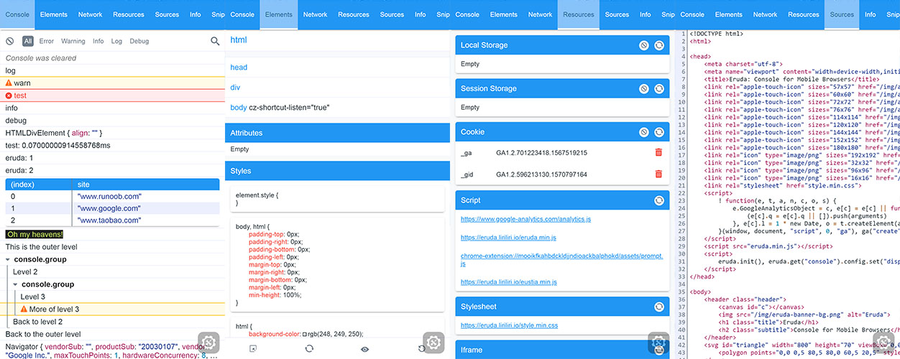

<a href="https://eruda.liriliri.io/" target="_blank">
    
</a>

# Eruda

[![Join the chat at https://gitter.im/liriliri/eruda][gitter-image]][gitter-url]
[![NPM version][npm-image]][npm-url]
[![Build status][travis-image]][travis-url]
[![Test coverage][codecov-image]][codecov-url]
[![License][license-image]][npm-url]

[gitter-image]: https://badges.gitter.im/liriliri/eruda.svg
[gitter-url]: https://gitter.im/liriliri/eruda?utm_source=badge&utm_medium=badge&utm_campaign=pr-badge&utm_content=badge
[npm-image]: https://img.shields.io/npm/v/eruda.svg
[npm-url]: https://npmjs.org/package/eruda
[travis-image]: https://img.shields.io/travis/liriliri/eruda.svg
[travis-url]: https://travis-ci.org/liriliri/eruda
[codecov-image]: https://codecov.io/github/liriliri/eruda/coverage.svg?branch=master
[codecov-url]: https://codecov.io/github/liriliri/eruda?branch=master
[license-image]: https://img.shields.io/npm/l/eruda.svg

Eruda 是一个专为手机网页前端设计的调试面板，类似 DevTools 的迷你版，其主要功能包括：捕获 console 日志、检查元素状态、捕获XHR请求、显示本地存储和 Cookie 信息等等。

## 功能清单



1. 按钮拖拽，面板透明度大小设置。

2. Console面板：捕获Console日志，支持log、error、info、warn、dir、time/timeEnd、clear、count、assert、table；支持占位符，包括%c自定义样式输出；支持按日志类型及正则表达式过滤；支持快捷命令加载underscore、jQuery库；支持JavaScript脚本执行。

3. Elements面板：查看标签内容及属性；查看应用在Dom上的样式；支持页面元素高亮；支持屏幕直接点击选取；查看Dom上绑定的各类事件。

4. Network面板：捕获请求，查看发送数据、返回头、返回内容等信息。

5. Resources面板：查看并清除localStorage、sessionStorage及cookie；查看页面加载脚本及样式文件；查看页面加载图片。

6. Sources面板：查看页面源码；格式化html，css，js代码及json数据。

7. Info面板：输出URL及User Agent；支持自定义输出内容。

8. Snippets面板：页面元素添加边框；加时间戳刷新页面；支持自定义代码片段。

## 快速上手

通过CDN使用：

```html
<script src="//cdn.bootcss.com/eruda/1.5.2/eruda.min.js"></script>
<script>eruda.init();</script>
```

通过npm安装：

```bash
npm install eruda --save
```

在页面中加载脚本：

```html
<script src="node_modules/eruda/eruda.min.js"></script>
<script>eruda.init();</script>
```

Js文件对于移动端来说略重（gzip后大概100kb）。建议通过url参数来控制是否加载调试器，比如：

```javascript
;(function () {
    var src = 'node_modules/eruda/eruda.min.js';
    if (!/eruda=true/.test(window.location) && localStorage.getItem('active-eruda') != 'true') return;
    document.write('<scr' + 'ipt src="' + src + '"></scr' + 'ipt>');
    document.write('<scr' + 'ipt>eruda.init();</scr' + 'ipt>');
})();
```

初始化时可以传入配置：
* container: 用于插件初始化的Dom元素，如果不设置，默认创建div作为容器直接置于html根结点下面。
* tool：指定要初始化哪些面板，默认加载所有。

```javascript
let el = document.createElement('div');
document.body.appendChild(el);

eruda.init({
    container: el,
    tool: ['console', 'elements'],
    useShadowDom: true
});
```

> 该工具支持自行编写插件，可参考[eruda-fps](https://github.com/liriliri/eruda-fps)。

## Demo


请扫描二维码或在手机上直接访问：[https://eruda.liriliri.io/](https://eruda.liriliri.io/)

如果想在其它页面尝试，请在浏览器地址栏上输入以下代码。

```javascript
javascript:(function () { var script = document.createElement('script'); script.src="//cdn.jsdelivr.net/npm/eruda"; document.body.appendChild(script); script.onload = function () { eruda.init() } })();
```
